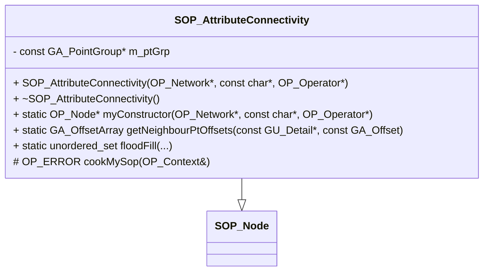

<h1 align="center">Attribute Connectivity</h1>

<div align="center">
  <a href="https://www.sidefx.com/"></a>
  <a href="https://github.com/ParkerBritt?tab=repositories&q=&type=&language=c%2B%2B&sort="></a>
  <a href="https://github.com/ParkerBritt?tab=repositories&q=&type=&language=python&sort="></a><br>
  
</div><br>

<p align="center"> Attribute connectivity is a <strong>Houdini</strong> SOP for <strong>indexing attributes</strong> by connectivity</p>     


# Overview
The Attribute Connectivity sop provides **connected component labeling** for Houdini attributes using flood fill analysis.
In other words it provides an index based on attribute values.
It achieves this by separating foreground and background components based on the threshold parameter, then assigning a unique index to each discontinuous island.


This node was written in C++ using the HDK.

# Parameters
| **Parameter**              | **Description**                                                                                                  |
|--------------------------|--------------------------------------------------------------------------------------------------------------------|
| **Group**               | A subset of points in the input geometry to run the program on. Leave this blank to affect all points in the input. |
| **Include Whole Islands** | Include islands that have at least one point in the group.                                                        |
| **Threshold**           | A threshold that separates the background and foreground values.                                                    |
| **Attribute Name**      | Name of the attribute to analyze.                                                                                   |
| **Output Index Attribute** | Name of the label attribute.                                                                                     |


# Build
### Dependencies
#### For Build
- Cmake
- ninja
- Houdini 20.5.X
> [!NOTE]
> other versions will very likely work but are untested
#### For Tests
- gtest
- python 3.11
- pytest

### Installation
To compile the program you can run the build script that's included.
```sh
./build.sh
```
The resulting .so file should be automatically placed in your ```$HOUDINI_USER_PREF_DIR/dso/``` directory.

Next copy ```./static/SOP_attribconnectivity.svg``` to ```$HOUDINI_USER_PREF_DIR/config/icons/```

# Class Diagram



# Example
### Input attribute visualized as color

### Output indexing visualized as color

### Output indexing values


# Reference
The HDK documentation and examples were used extensively in the development of this project.
